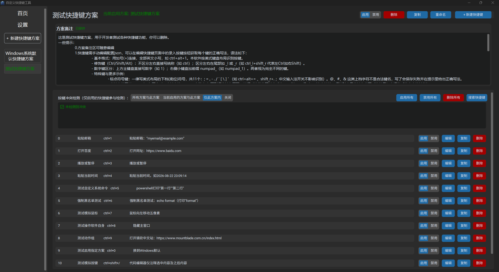
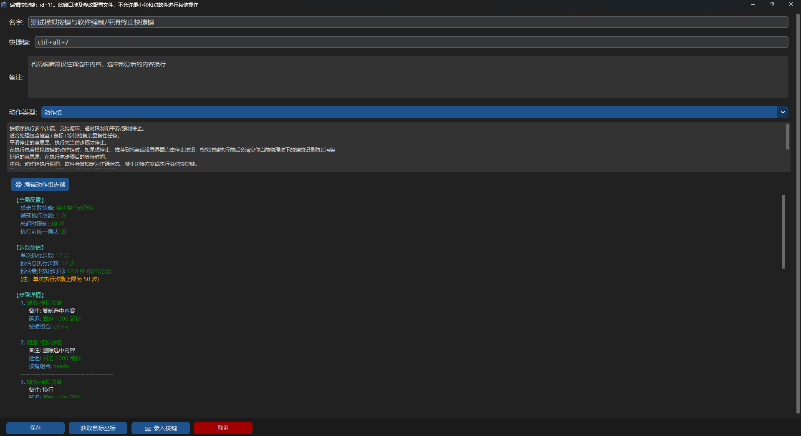

# 自定义快捷键工具 · Customize Shortcut Keys

**让重复性操作回归键盘**

Windows 平台的全局快捷键工具：自定义组合键 → 任意动作，支持动作组、冲突检测、安全拦截，低占用。

---

## 📸 截图

| 主界面 | 编辑界面 |
| --- | --- |
|  |  |

## ✨ 功能特性

### 🎯 全局快捷键
- 任意键组合：支持 Win 键、小键盘、功能键、标点键
- 后台监听，低占用

### 🧩 丰富的动作类型

| 动作            | 说明                                |
|-----------------|-------------------------------------|
| 粘贴指定文本    | 如 `ctrl+1` 一键粘贴文本            |
| 打开路径 / 网址 | 文件、文件夹、程序、网页            |
| 插入日期时间    | 自定义格式                          |
| 媒体与音量控制  | 播放 / 暂停等                       |
| 自定义系统命令  | 目前仅支持CMD / PowerShell / Python |
| 鼠标操作        | 移动、点击、拖拽                    |
| 模拟按键组合    | `ctrl+c`、`ctrl+v` 等               |
| 切换快捷键方案  | 一键热切换                          |
| 操作软件自身    | 显示 / 隐藏主窗口等                 |

### 🎬 动作组
把多个动作串成序列自动执行——处理"大部分靠键盘、偏偏最后一步要鼠标"的重复性任务：
- 步骤级延迟、循环次数、总超时控制
- 试运行 + 实时日志，调试无忧
- 硬性限制（50 步 / 120 秒）防失控

### 🛡️ 三层安全拦截（自定义命令）
1. **强制黑名单**（内置，不可逾越）：`format`、`diskpart` 等直接拒绝
2. **用户自定义黑名单**：命中需强制确认
3. **常规确认**：可按快捷键单独配置执行前提示

### 🚨 软件级停止组合
动作组可能劫持鼠标，键盘是可靠的逃生口：
- **强制停止**：`右Ctrl + 右Alt + Esc` —— 立即终止
- **平滑停止**：`左Ctrl + 左Alt + Esc` —— 当前步骤做完再停

### 🔍 冲突检测
- 方案内自动查重，也可跨方案对比分析
- 内置 Windows 系统默认快捷键方案
- 更多常用软件的预设方案：[shortcut-scheme-presets](https://github.com/sefrawe/shortcut-scheme-presets)

### 🖥️ 其他
- 现代化 GUI，深色 / 浅色主题跟随
- 系统托盘常驻：暂停 / 恢复监听、切换方案、停止动作组
- 开机自启、静默启动到托盘
- 快捷键搜索窗口
- ⌨ 录入按键：实时显示你按下的每个键的规范写法（教学工具）

## ⌨️ 快捷键语法（速览）

- 用 `+` 连接，全部小写：`ctrl+alt+1`
- 小键盘：`numpad_1`；运算键 `numpad_add` / `numpad_subtract` 等
- 标点键写美式布局底位符：`ctrl+alt+=`、`ctrl+/`（`@`、`#` 这类上档字符不是合法键名）
- Win 键写 `cmd`，如 `cmd+e`

> 💡 完整说明见软件内置「测试快捷键方案」的方案备注。

## 🚀 快速开始

### 方式一：下载即用（推荐普通用户）

前往 [Releases](https://github.com/sefrawe/Customize-shortcut-keys/releases) 下载最新的 zip，解压到任意目录（建议用户目录下），双击 exe 即可。

> ⚠️ 建议放在当前用户有写权限的目录（如 `D:\Tools\`），不要放 Program Files——软件需要在自身目录下的 `config/` 文件夹读写方案。

### 方式二：从源码运行

**环境要求**：Windows 10 / 11，Python 3.12（其它版本未测试）

下载好依赖（详见 `requirements.txt`）后，运行main.py即可
